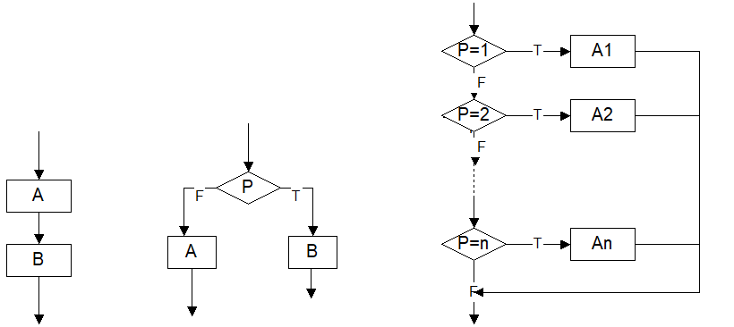
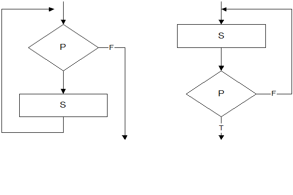
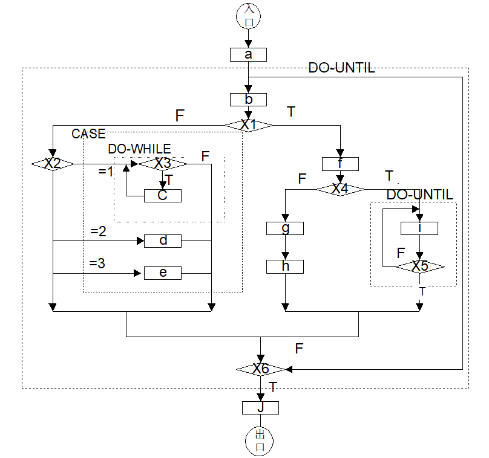

# 详细设计规约

[TOC]

## 文档版本

| 版本号 | 开发组 | 修改时间 | 修改人 | 修改内容 | 评审组 | 评审时间 | 评审意见 | 评审结论 |
| ------ | ------ | -------- | ------ | ------ | -------- | -------- | -------- | -------- |
| 1 | 树梢游戏 | 2020.01.17 | 梁荣嘉 |        |          |          |||

> 详细设计说明书又可称程序设计说明书。编写的目的是说明一个软件系统结构中每个子系统或微服务或类的的设计考虑，如果一个软件系统比较简单，层次很少，本文件可以不单独编写，有关内容合并如概要设计说明书。

## 引言

### 编写目的

### 背景与依据

### 参考资料

## 系统软件结构（即是概要设计的2.2节中的软件体系结构）

## 子系统设计（没有子系统可以忽略）

### 子系统描述

### 功能（包含哪些微服务或类）

### 和哪些子系统有交互（接口）

## 微服务设计（没有微服务可以忽略）

### 微服务功能

### 和哪些微服务有交互（接口）

## 类设计

### 程序描述

### 功能

### 性能（可能不考虑）

### 输入项（输入接口）

### 输出项（输出接口）

### 属性详细描述

### 方法详细描述及实现流程

### 类内、类外方法调用状态图

### 限制条件及出错处理

> 附录二 程序流程图画法提示
>
> 程序流程图也称为程序框图，是软件开发者最熟悉的一种算法表达工具。它独立于任何一种程序设计语言，比较直观、清晰，易于学习掌握。因此，至今仍是软件开发者最普遍采用的一种工具。人们在需要了解别人开发软件的具体实现方法时，常常需要借助流程图，来理解其思路及处理方法。
>
> 但是，流程图也存在一些严重的缺点。例如流程图所使用的符号不够规范，常常使用一些习惯性用法。特别是表示程序控制流程的箭头，使用的灵活性极大，程序员可以不受任何约束，随意转移控制。这些问题常常会使程序质量受到很大的影响。这些现象显然是与软件工程化的要求相背离的。为了消除这些缺点，应对流程图所用的符号做出严格的定义，不允许人们随心所欲地画出各种不规范的流程图。
>
> 首先，为使用流程图描述结构化程序，必须限制流程图只能使用图1所给出的五种基本控制结构。
>
> 这五种基本的控制结构是：
>
> (1) 顺序型：几个连续的加工步骤依次排列构成；
>
> (2) 选择型：由某个逻辑判断式的取值决定选择两个加工中的一个；
>
> (3) 先判定(while)型循环：在循环控制条件成立时，重复执行特定的加工；
>
> (4) 后判定(until)型循环:重复执行某些特定的加工，直至控制条件成立；
>
>  
>
> 1)顺序型 2)选择型     5)多情况选择型                                 (CASE型)
>
> 3)先判定型循环           4)后判定型循环
>
>  (DO-WHILE)              (DO-UNTIL)
>
> 图1 流程图的基本控制结构
>
>  
>
> (5) 多情况(case)型选择：列举多种加工情况，根据控制变量的
>
> 取值，选择执行其一。
>
> 任何复杂的程序流程图都应由这五种基本控制结构组合或嵌套而成。作为上述五种控制结构相互组合和嵌套的实例，图2给出一个程序的流程图。图中增加了一些虚线构成的框，目的是便于理解控制结构的嵌套关系。显然，这个流程图所描述的程序是结构化的。
>
>  
>
> 
>
> 图2 嵌套结构的流程图实例